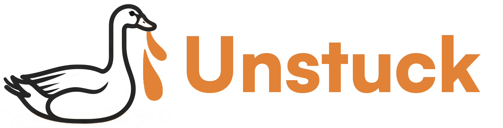

# unstuck-ai

<div align="center">
  <a href="https://unstuck-goose.nyc3.cdn.digitaloceanspaces.com/Screen%20Recording%202025-05-17%20at%204.52.34%E2%80%AFPM.MOV">
    
  </a>
  <p>👆 Click the image to watch the demo video 👆</p>
</div>

MCP server enabling AI agents to instantly pay humans sats (Bitcoin) to solve visual roadblocks (captchas, web navigation, computer use) via a Nostr marketplace. Includes the MCP server and web app for humans to bid on tasks, complete them, and get paid.

## Development Plan

Components:

1. MCP Server

    - [x] sends a kind 5109 event request for visual computer interaction help
    - [x] listens for feedback responses for prices and corresponding invoices
    - [x] selects an offer by paying the invoice
    - [x] receives the result, returns it as the result of the MCP tool call
    - [x] (testing) check invoice was paid in payment simulator before sending 6109
    - [x] get image upload working on digital ocean
    - [x] get goose or claude to take a screenshot and call the mcp tool correctly
    - [ ] get goose to execute the action that the human gives (from the result of the mcp tool call)

2. Unstuck Frontend (Job Board and Workspace)
    - [x] User login via Nostr
    - [x] Pull job offers from Nostr relays
    - [ ] Allow user to set a default job amount in sats
    - [x] Display job offers
    - [x] Allow user to select a job
        - [x] generate a lightning invoice for the amount
        - [x] broadcast a kind 7000 event with the invoice and price
        - [ ] show a notification when the invoice was paid
    - [x] Show a workspace like page for the user to do the work
    - [x] Send the final job result event when the user is done

 
 ## How to use

 ```bash
 cd mcp_server/
 fastmcp run unstuck_with_nostr_working.py:mcp --transport sse
 ```

 then in another terminal run goose

 ```bash
 goose session --with-remote-extension http://127.0.0.1:8000/sse
 ```

and then you can try using it with a propmt to goose like:

```bash
( O)> can you take a screenshot of my whole screen and then send a request using unstuck helper tool to ask a human what icon I can click to open discord? Please use this method of taking screenshots: mkdir -p ~/screenshots && screencapture -x ~/screenshots/desktop_screenshot_$(date +%Y%m%d_%H%M%S).png && ls -la ~/screenshots/ | grep png | tail -1
```
